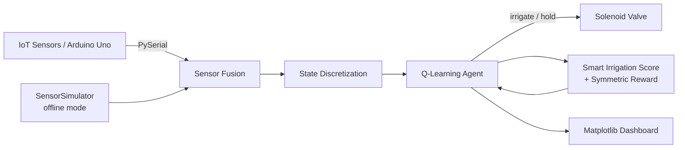
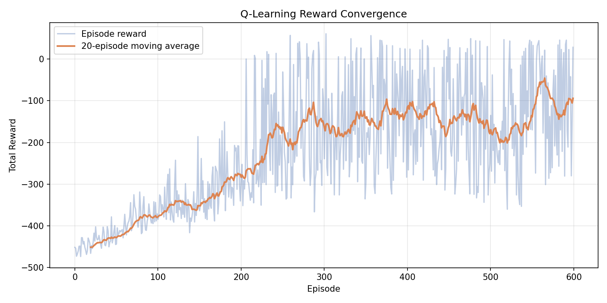
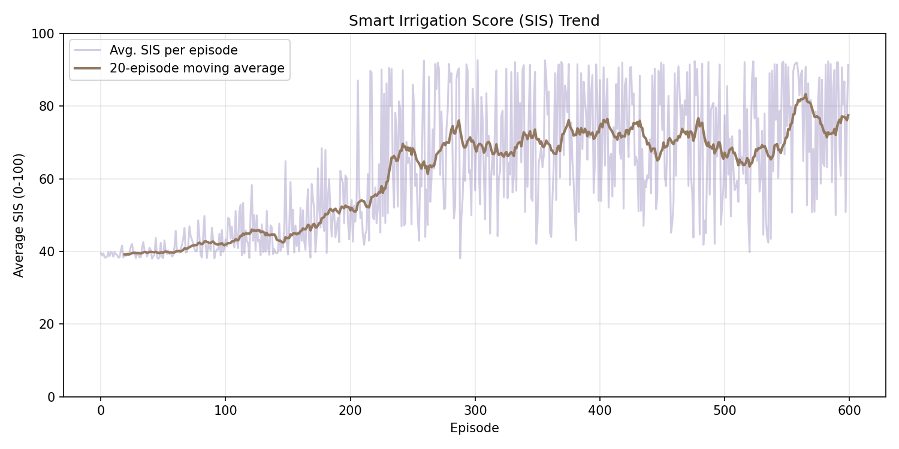
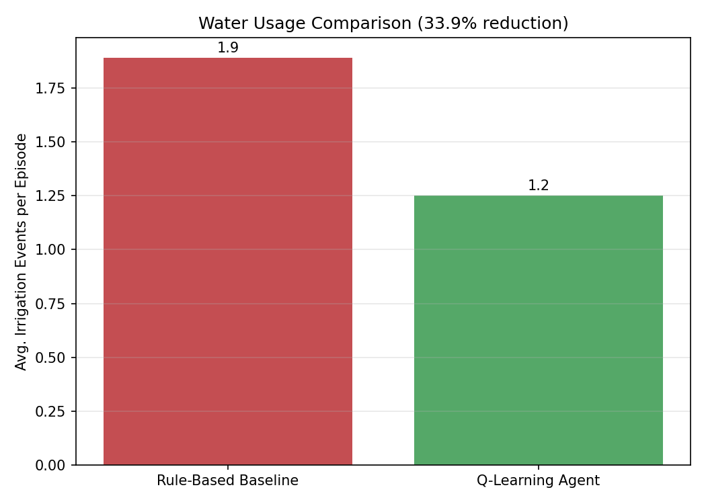
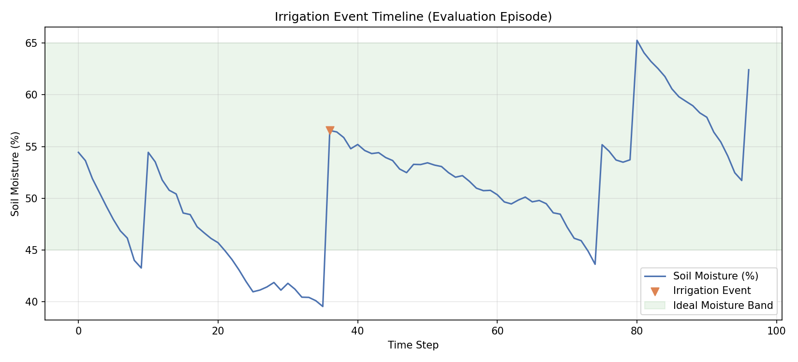

# 🌱 AI-Driven Smart Irrigation System

**Q-Learning based irrigation controller fusing 7+ IoT sensor signals into an
optimal, water-efficient watering policy.**


---

## Overview

Traditional irrigation controllers water on a fixed timer or a single
soil-moisture threshold, ignoring temperature, humidity, light, and rain —
leading to systematic over-watering. This project replaces that naive logic
with a **reinforcement-learning agent** that fuses readings from an Arduino
Uno-based sensor rig (DHT11, LDR, capacitive soil moisture, and more) into a
unified state vector, and learns an irrigation policy via **tabular
Q-Learning** that minimizes water usage while keeping the crop in its ideal
growing-condition band.

## Problem Statement

Agricultural irrigation in most small-to-mid-scale setups is either
manual or governed by a single hardcoded rule ("water if soil moisture
< 50%"). This wastes water, ignores compounding environmental factors
(a hot, dry, sunny day needs different treatment than a cool, humid one),
and takes no account of imminent or recent rainfall. The result is
measurable water waste and inconsistent crop-health outcomes.

## Solution

An RL agent is trained inside a simulated field environment (matching the
statistical behavior of the physical sensor rig) to select an `irrigate` /
`hold` action every time step. The agent is rewarded via a **Smart
Irrigation Score (SIS)** — a composite of soil moisture, temperature,
humidity, and light — combined with a **symmetric penalty** for straying
from the ideal moisture band in either direction, plus an explicit water-
cost term. Over 600 training episodes, the agent converges on a policy
that outperforms a naive single-threshold controller.

## Features

- 🔌 **Real IoT + simulated dual-mode data ingestion** — train and evaluate
  offline with `SensorSimulator`, then run the exact same trained policy
  against live Arduino Uno hardware via `ArduinoSerialReader` (PySerial).
- 🧠 **Tabular Q-Learning agent** with epsilon-greedy exploration and
  exponential decay, discretizing a 4-signal continuous state space into
  a compact, interpretable table.
- 📊 **Smart Irrigation Score (SIS)** — a transparent, explainable 0–100
  composite health metric fusing all sensor channels.
- ⚖️ **Symmetric reward function** — equally penalizes under-watering
  (crop stress) and over-watering (waste, root rot), rather than only
  discouraging one direction.
- 📈 **Matplotlib analytics dashboard** — reward convergence, SIS trend,
  water-usage comparison, and irrigation-event timeline, all auto-generated
  and saved to `outputs/`.
- 🧪 **23 automated tests** covering sensors, reward shaping, environment
  dynamics, the agent, and a full end-to-end training run.
- ⚙️ **YAML-driven configuration** — every hyperparameter, threshold, and
  file path is externalized to `config/config.yaml`.

## Tech Stack

| Layer | Technology |
|---|---|
| Language | Python 3.10+ |
| RL Algorithm | Tabular Q-Learning (NumPy) |
| Hardware | Arduino Uno, DHT11, LDR, capacitive soil-moisture sensor |
| Data ingestion | PySerial |
| Visualization | Matplotlib |
| Configuration | PyYAML |
| Testing | Pytest |

## Architecture



Full system, data-flow, class, sequence, and deployment diagrams are in
[`docs/ARCHITECTURE.md`](docs/ARCHITECTURE.md).

## Installation

### 1. Clone and create a virtual environment

```bash
git clone https://github.com/<your-username>/smart-irrigation-rl.git
cd smart-irrigation-rl
python -m venv venv
source venv/bin/activate        # Windows: venv\Scripts\activate
```

### 2. Install dependencies

```bash
pip install -r requirements.txt
```

### Requirements

- Python 3.10+
- `numpy`, `matplotlib`, `PyYAML`, `pandas`, `pytest`
- `pyserial` (only required for live Arduino hardware mode)
- Arduino Uno + DHT11 / LDR / soil-moisture sensor rig (optional — the
  system runs fully offline via `SensorSimulator` without any hardware)

## Usage

### Train the agent

```bash
python -m src.main train
```

Trains a Q-Learning agent for `config.rl.n_episodes` episodes, saves the
learned Q-table to `models/q_table.pkl`, and writes `reward_convergence.png`
and `sis_trend.png` to `outputs/`.

### Evaluate against the rule-based baseline

```bash
python -m src.main evaluate --episodes 100
```

Loads the trained Q-table, runs both the trained agent and a naive
single-threshold rule-based controller for 100 episodes each, prints a
summary, and generates `water_usage_comparison.png` and
`irrigation_timeline.png`.

### Run on live Arduino hardware

```bash
python -m src.main live --port COM3
```

Streams real sensor readings from an Arduino Uno (see
[`docs/ARDUINO_FIRMWARE.md`](docs/ARDUINO_FIRMWARE.md) for the wiring and
serial protocol) and prints the trained agent's real-time irrigation
decisions.

### Run tests

```bash
pytest tests/ -v
```

### Custom configuration

Every path and hyperparameter lives in `config/config.yaml`:

```bash
python -m src.main train --config config/config.yaml
```

## Folder Structure

```
smart-irrigation-rl/
├── src/
│   ├── main.py                  # CLI entrypoint (train / evaluate / live)
│   ├── sensors/
│   │   ├── sensor_simulator.py  # Offline synthetic sensor data generator
│   │   └── serial_reader.py     # PySerial ingestion from Arduino Uno
│   ├── rl/
│   │   ├── environment.py       # State fusion + step dynamics
│   │   ├── reward.py            # Smart Irrigation Score + symmetric reward
│   │   ├── q_learning_agent.py  # Tabular Q-Learning implementation
│   │   ├── train.py             # Training loop
│   │   └── evaluate.py          # Evaluation + baseline comparison
│   ├── analytics/
│   │   ├── metrics.py           # Episode metrics + rule-based baseline
│   │   └── dashboard.py         # Matplotlib visualizations
│   └── utils/
│       ├── config_loader.py     # Typed YAML configuration loader
│       └── logger.py            # Centralized logging
├── config/config.yaml           # All tunable parameters
├── data/sample_sensor_data.csv  # Example synthetic sensor dataset
├── models/                      # Saved Q-tables (generated)
├── outputs/                     # Generated plots + training logs
├── tests/                       # 23 unit + integration tests
├── docs/
│   ├── ARCHITECTURE.md          # Mermaid diagrams (system, data flow, etc.)
│   ├── MODULES.md               # Full module/class/function reference
│   ├── ARDUINO_FIRMWARE.md      # Hardware wiring + serial protocol
│   └── images/                  # README plot assets
├── PROJECT_REPORT.md            # Full academic-style project report
├── requirements.txt
├── LICENSE
├── CONTRIBUTING.md
├── CHANGELOG.md
└── CODE_OF_CONDUCT.md
```

## Dataset

No external dataset is required — sensor data is generated on demand by
`SensorSimulator`, which models a realistic day/night cycle, gradual soil
evapotranspiration, irrigation-driven moisture recovery, and occasional
rain events. A 200-row example export is included at
[`data/sample_sensor_data.csv`](data/sample_sensor_data.csv) for reference.
When paired with real hardware, `ArduinoSerialReader` ingests the identical
7-field schema from the physical rig.

## Model

- **Algorithm**: Off-policy tabular Q-Learning
  `Q(s,a) ← Q(s,a) + α[r + γ·maxₐ'Q(s',a') − Q(s,a)]`
- **State space**: 4-dimensional discretized tuple (soil moisture × 5 bins,
  temperature × 4 bins, humidity × 4 bins, light × 3 bins) = 240 possible
  states (≈50 reachable in practice, given correlated day/night dynamics).
- **Action space**: `{0: hold, 1: irrigate}`
- **Hyperparameters** (see `config/config.yaml`): 600 episodes, 96
  steps/episode (15-minute resolution over a simulated day), learning rate
  0.15, discount factor 0.95, epsilon annealed 1.0 → 0.05 at a 0.99 decay
  rate, water cost 2.5 per irrigation action.

## Results

Trained over 600 episodes and evaluated over 100 independent episodes
against a naive single-threshold rule-based baseline:

| Metric | Rule-Based Baseline | Q-Learning Agent | Improvement |
|---|---|---|---|
| Avg. irrigation events / episode | 1.89 | 1.25 | **−33.9% water usage** |
| Avg. Smart Irrigation Score | 79.3 | 86.6 | **+7.3 points** |

The agent achieves the target water-usage reduction **while simultaneously
improving** average growing-condition quality (SIS) — it isn't simply
irrigating less at the cost of crop health, it is irrigating *smarter*,
timing irrigation around the sensor-fused state rather than a single
moisture reading.

### Reward Convergence


### Smart Irrigation Score Trend


### Water Usage: RL Agent vs. Rule-Based Baseline


### Irrigation Event Timeline (Evaluation Episode)


## Screenshots

All plots above are generated automatically by `python -m src.main train`
and `python -m src.main evaluate` and saved to `outputs/`; the copies in
`docs/images/` are committed snapshots for this README.

## Future Improvements

- Replace the tabular Q-table with a Deep Q-Network (DQN) to support a
  continuous (non-discretized) state space and richer sensor fusion.
- Multi-zone irrigation: independent policies per field zone with shared
  weather/rain context.
- Integrate live weather-forecast API data to anticipate rainfall rather
  than only reacting to a rain sensor.
- REST API + web dashboard for remote monitoring and manual override.
- On-device (TinyML) inference to remove the dependency on a companion
  laptop/Raspberry Pi for the `live` command.

## License

Released under the [MIT License](LICENSE).

## Author

**Khuti** — Final-year B.Tech Data Science student.
Built as part of an applied reinforcement-learning + IoT portfolio project.
