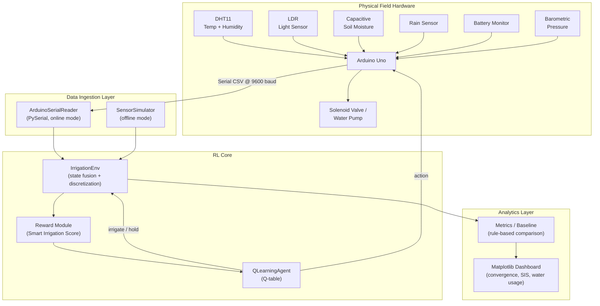
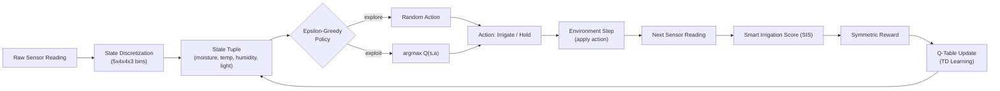
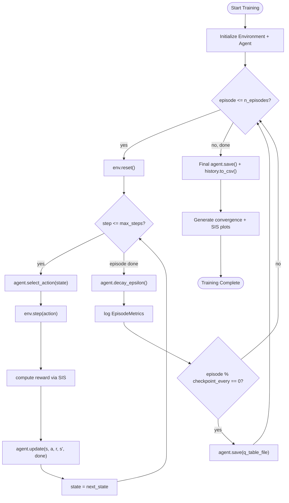
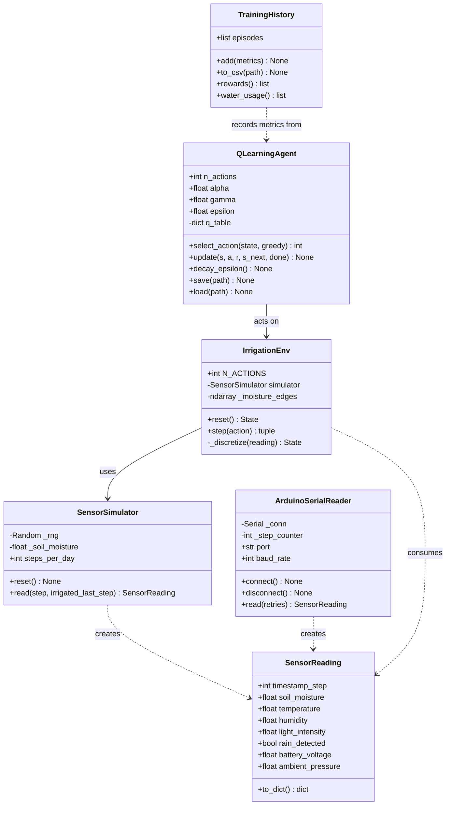
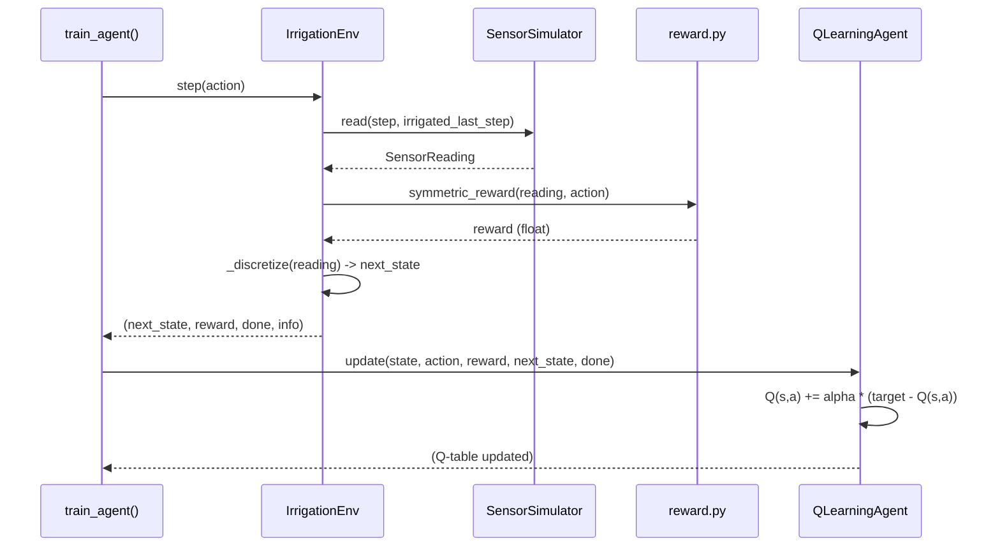
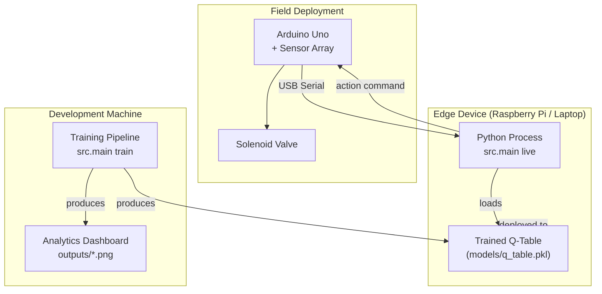

# System Architecture

This document describes the end-to-end architecture of the AI-Driven Smart
Irrigation System: how sensor data flows into the RL agent, how the agent
is trained and evaluated, and how the components map onto the physical
Arduino Uno hardware.

## 1. High-Level System Architecture

## 2. Data Flow

## 3. Training Workflow

## 4. Class Diagram

## 5. Sequence Diagram — Single Training Step

## 6. Deployment Diagram

## Component Responsibilities

| Component | Responsibility |
|---|---|
| `SensorSimulator` | Generate temporally-coherent synthetic sensor data for offline training/demo. |
| `ArduinoSerialReader` | Parse real-time CSV sensor payloads streamed over USB serial from the Arduino Uno. |
| `IrrigationEnv` | Fuse raw sensor values into a discretized state, apply actions, compute rewards, and manage episode termination. |
| `reward.py` | Compute the Smart Irrigation Score (SIS) and the symmetric reward signal. |
| `QLearningAgent` | Maintain the Q-table, select actions via epsilon-greedy policy, and apply the Q-Learning update rule. |
| `metrics.py` | Track per-episode training metrics and run the rule-based baseline for comparison. |
| `dashboard.py` | Render all Matplotlib visualizations used in the README and project report. |
| `main.py` | CLI entrypoint tying together training, evaluation, and live-inference workflows. |
